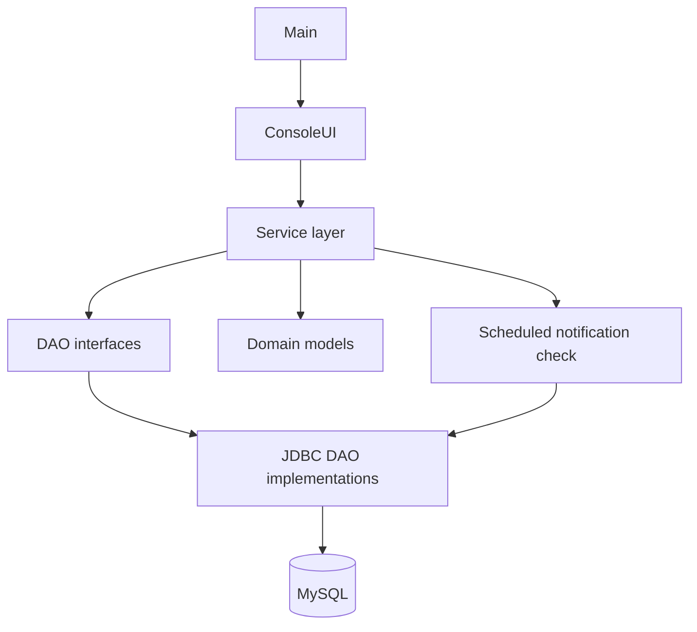
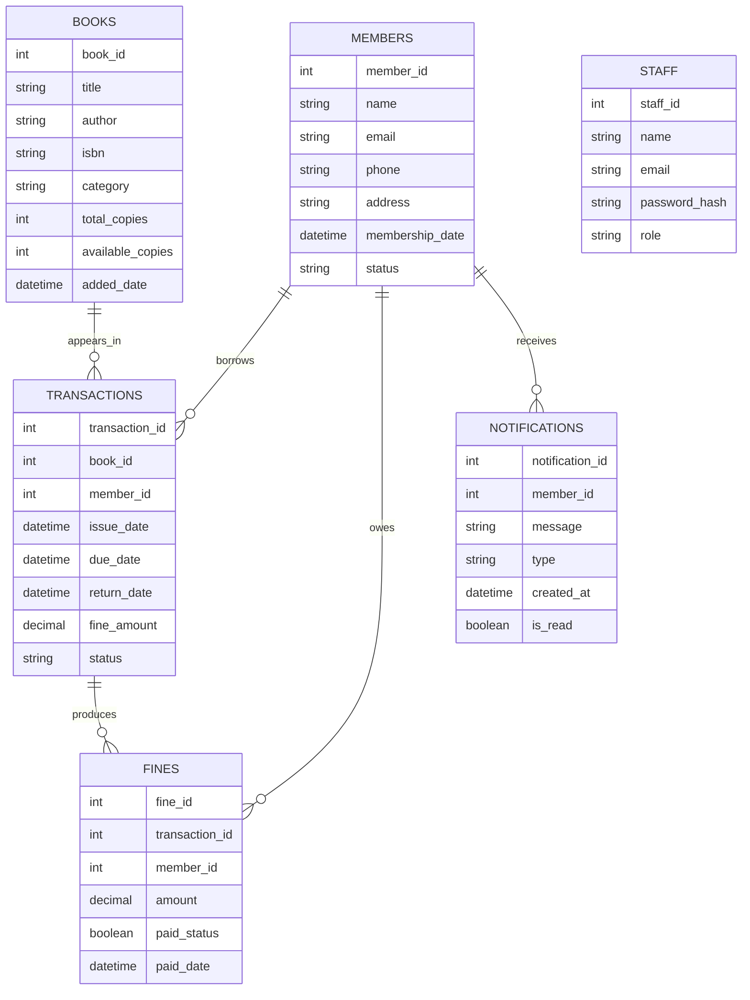

# Library Management System

A console-based Java application for managing books, library members, staff access, borrowing transactions, overdue fines, and member notifications. The application uses JDBC to persist data in MySQL and provides separate menu flows for administrators, library staff, and members.

> **Repository scope:** This repository contains a command-line application. No web frontend, REST API, Maven build file, Docker configuration, automated tests, or database schema/migration script is present in the current source tree.

## Features

### Staff and administrator access

- Staff login by email and password.
- Role-based menu selection for `ADMIN` and non-admin staff roles.
- Invalid credentials are reported through `InvalidLoginException`.
- Admin users can manage books and members and review fines, overdue transactions, and notifications.
- Staff users can issue and return books and view books, members, and notifications.

### Book management

- Add books with title, author, ISBN, category, and copy counts.
- Update book metadata and availability.
- Delete books.
- Search by title, author, ISBN, or category.
- List all books.
- Track total and available copies.

### Member management

- Register members with name, email, phone, address, and status.
- Look up members by ID or email.
- List active members.
- Deactivate members through the service/DAO layer.
- View a member's borrowing history from the member menu.

### Borrowing and returns

- Issue a book to a member when a copy is available.
- Create a transaction with a due date 14 days after issue.
- Decrease available copies when a book is issued.
- Return books using a transaction ID.
- Increase available copies after return.
- List overdue transactions.
- Calculate a late fine at `10` currency units per late day.

### Fines and notifications

- Create a fine record when a book is returned.
- View all fines and fines for a member through the service layer.
- Mark fines as paid through the DAO/service layer.
- Create issue notifications.
- Run a scheduled daily check for due-soon and overdue books.
- View notifications for an individual member or all members.
- Mark notifications as read.

## Technology Stack

| Technology | Purpose |
| ---------- | ------- |
| Java | Application language and console application runtime |
| JDBC | Direct database access through DAO implementations and prepared statements |
| MySQL | Relational persistence for books, members, staff, transactions, fines, and notifications |
| MySQL Connector/J `8.4.0` | JDBC driver for MySQL |
| jBCrypt `0.4` | Included password-hashing library; the current login implementation compares the stored value directly instead of calling BCrypt |
| SLF4J API `2.0.16` | Logging facade used by selected data-access/services classes |
| Logback Classic/Core `1.5.8` | Logging implementation included on the runtime classpath |

The project does not currently use Spring Boot, Jakarta EE, a web framework, an ORM, JWT/OAuth, React, Node.js, Docker, or a REST API.

## Architecture

This is a single-process, layered console application:



### Runtime flow

1. `com.library.Main` creates `ConsoleUI` and starts the interactive loop.
2. `ConsoleUI` presents top-level, admin, staff, and member menus.
3. Services such as `BookService`, `MemberService`, and `TransactionService` apply application rules.
4. DAO implementations execute parameterized SQL through `DatabaseConfig.getConnection()`.
5. Model classes such as `Book`, `Member`, `Transaction`, `Fine`, and `Notification` represent database records.
6. `NotificationService` starts a single-thread scheduled executor and checks for due reminders and overdue books once per day.

There is no frontend/backend network boundary: the console UI, business logic, and database access run in the same Java process.

## Authentication and Authorization

The implemented authentication flow is staff-only:

```text
Staff enters email and password
        |
        v
StaffService.login()
        |
        v
StaffDAOImpl finds the staff record by email
        |
        v
Stored password value is compared with the supplied password
        |
        v
Role selects ADMIN or staff menu
```

- Staff records contain a `role` value used by `ConsoleUI` to select the admin or staff menu.
- Members are identified in the console by entering a member ID; there is no member password or member authentication flow.
- No session, token, JWT, OAuth, or HTTP security filter is implemented.
- Although jBCrypt is included and BCrypt code is present in comments, the active implementation uses `storedPassword.equals(password)`. Password handling should therefore be treated as a current security limitation, not as BCrypt-protected authentication.

## Database

The Java DAOs issue SQL against MySQL tables named:

- `books`
- `members`
- `staff`
- `transactions`
- `fines`
- `notifications`

The repository does not contain the `library_schema.sql` file referenced by the previous README, so the complete schema, constraints, indexes, and foreign keys cannot be verified from the current tree. The relationships implied by the Java code are:



### Database configuration status

The current source contains database values in both `src/main/resources/config.properties` and `DatabaseConfig.java`, but `DatabaseConfig.getConnection()` currently uses the hard-coded JDBC URL, username, and placeholder password in Java. The properties file is not read by the active connection method. Before running the application, configure the connection values in the implementation or update the connection code to load the properties file; do not commit real credentials.

## Project Structure

```text
Library-Management-System/
├── lib/                              Local runtime JAR dependencies
├── out/                              Compiled classes used by run.bat
├── target/                           Generated compiled/Maven-status artifacts
├── src/main/java/com/library/
│   ├── Main.java                     Application entry point
│   ├── config/DatabaseConfig.java   JDBC connection configuration
│   ├── dao/                          DAO contracts
│   ├── dao/impl/                     JDBC DAO implementations
│   ├── exception/                    Domain exceptions
│   ├── model/                        Book, Member, Staff, Transaction, Fine, Notification
│   ├── service/                      Application/business services
│   └── ui/ConsoleUI.java             Interactive command-line menus
├── src/main/resources/
│   └── config.properties             Database properties file; not currently loaded by DatabaseConfig
├── .idea/                            IntelliJ IDEA project metadata
├── run.bat                           Windows launcher using the out/ directory
└── README.md
```

## Prerequisites

- Java Development Kit compatible with the configured IntelliJ project language level. The checked-in IntelliJ metadata specifies JDK 25; the source uses standard Java language/library features and should be compiled with a compatible JDK.
- MySQL Server running locally on port `3306`.
- The required JAR files in `lib/`:
  - `mysql-connector-j-8.4.0.jar`
  - `jbcrypt-0.4.jar`
  - `slf4j-api-2.0.16.jar`
  - `logback-classic-1.5.8.jar`
  - `logback-core-1.5.8.jar`

No database initialization script is currently committed, so the required tables must be created separately using a schema compatible with the SQL in `src/main/java/com/library/dao/impl/`.

## Setup and Run

### 1. Clone the repository

```bash
git clone https://github.com/mayankgawande23/Library-Management-System.git
cd Library-Management-System
```

### 2. Configure MySQL

Create/configure a MySQL database and ensure the connection values used by `DatabaseConfig.getConnection()` point to it. The checked-in connection string currently ends with `/?`, so the database name is not specified by the active Java configuration.

Do not put real passwords in Git. The committed `config.properties` contains a placeholder and is not currently consumed by `DatabaseConfig`.

### 3. Compile on Windows PowerShell

The repository does not include `pom.xml` or another build script. Compile the Java sources manually:

```powershell
New-Item -ItemType Directory -Force out | Out-Null
$cp = "lib\mysql-connector-j-8.4.0.jar;lib\jbcrypt-0.4.jar;lib\slf4j-api-2.0.16.jar;lib\logback-classic-1.5.8.jar;lib\logback-core-1.5.8.jar"
$sources = Get-ChildItem -Path src\main\java -Recurse -Filter *.java | ForEach-Object { $_.FullName }
javac -cp $cp -d out $sources
```

### 4. Run

```powershell
$cp = "lib\mysql-connector-j-8.4.0.jar;lib\jbcrypt-0.4.jar;lib\slf4j-api-2.0.16.jar;lib\logback-classic-1.5.8.jar;lib\logback-core-1.5.8.jar;out"
java -cp $cp com.library.Main
```

After compiling to `out/`, Windows users can also run:

```powershell
.\run.bat
```

## Usage Workflow

1. Start the application and choose **Staff/Admin Login** or **Member Menu**.
2. A staff member logs in with an email and password stored in the `staff` table.
3. An administrator can add/search/list/update/delete books, register members, view active members, inspect overdue transactions and fines, and review notifications.
4. Staff can issue a book by book ID and member ID, then return it with the transaction ID.
5. Members enter their member ID to view notifications and borrowing history.
6. Returning a late book records a calculated fine and restores the book's available-copy count.

## Technical Highlights

- Layered separation between console UI, services, DAO contracts, JDBC DAO implementations, and models.
- Prepared statements are used for database operations, including searches and updates.
- `TransactionService` coordinates transaction records, book availability, and fine creation.
- Due dates are calculated as 14 days from issue time.
- Late fines are calculated from the number of days after the due date.
- `NotificationService` uses `ScheduledExecutorService` for daily due-date and overdue checks.
- SLF4J/Logback logging is used in selected persistence and notification code.
- Custom exceptions cover invalid login, unavailable books, and missing members.

## Current Limitations and Future Improvements

The following are improvements suggested by the current implementation and are not presented as existing features:

- Add and commit a versioned database schema or migration mechanism.
- Replace hard-coded database credentials with environment variables or a properly loaded configuration file.
- Enable BCrypt verification in `StaffDAOImpl` and remove plaintext password comparison.
- Use a named database in the JDBC URL and correct connection lifecycle handling.
- Add transaction boundaries so issuing/returning a book and updating its copy count remain consistent if one operation fails.
- Add input validation, clearer error handling, and automated unit/integration tests.
- Add a build tool such as Maven or Gradle and exclude generated `out/` and `target/` artifacts from version control.
- Add a web/API layer only if a browser or external-client workflow is required.

## Author

**Mayank Gawande**
